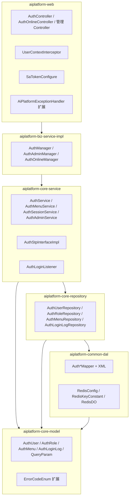
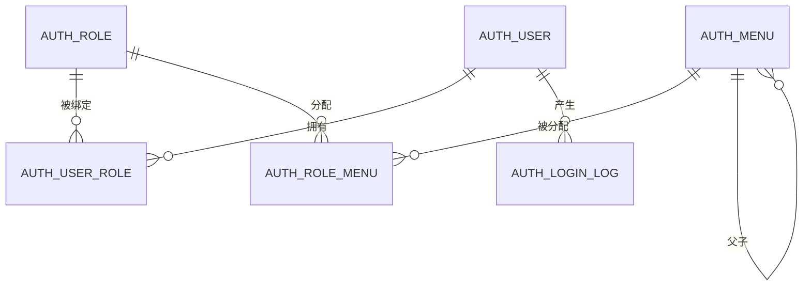
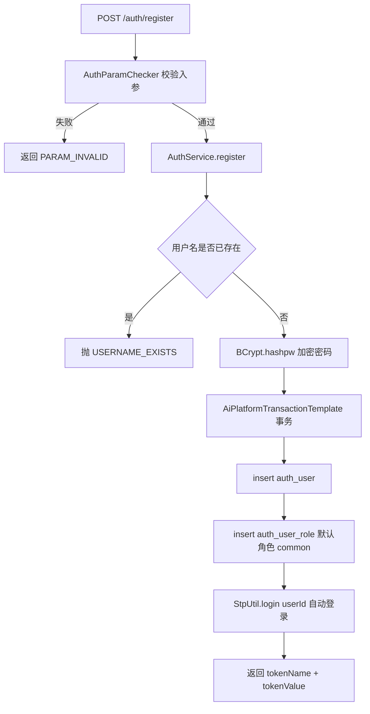
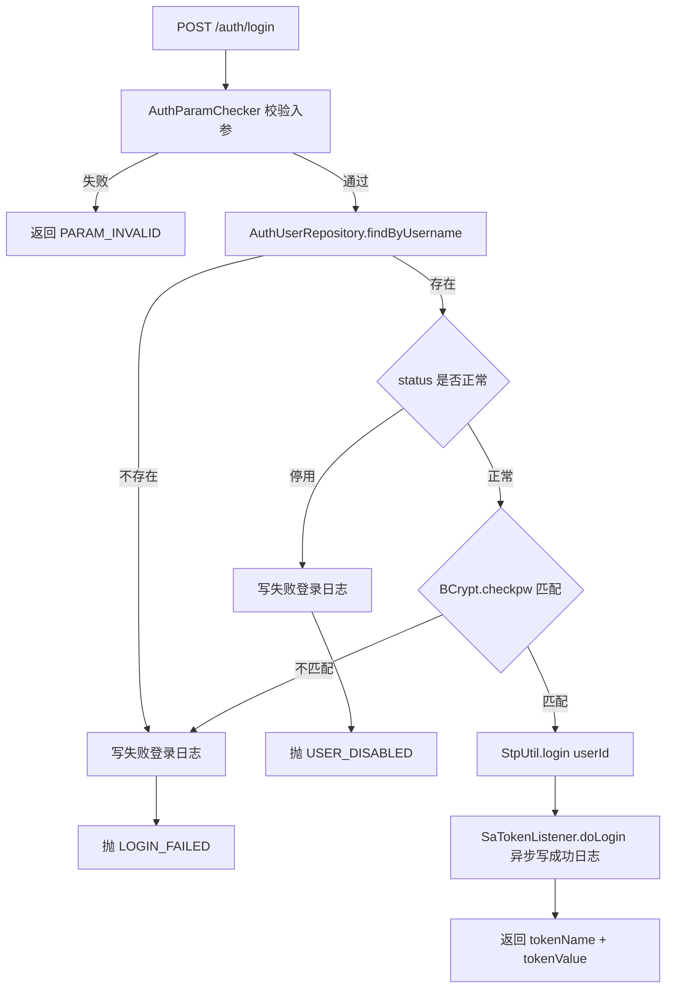
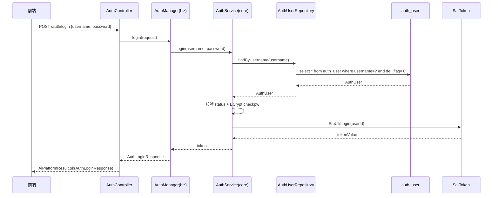
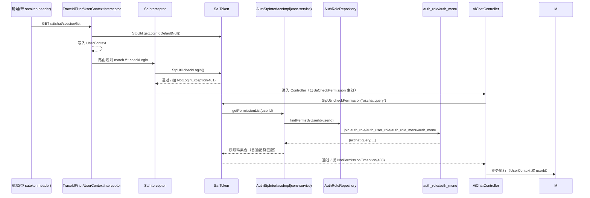
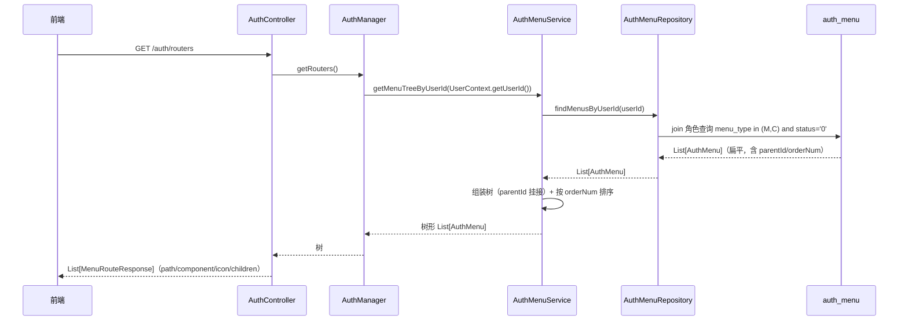
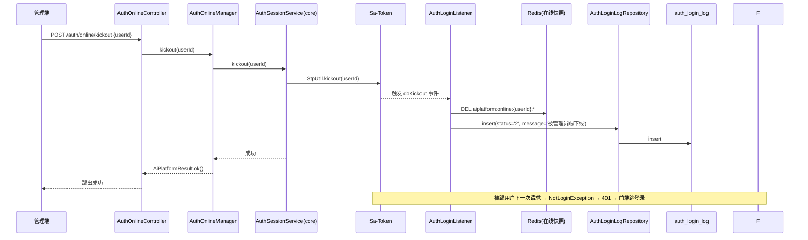
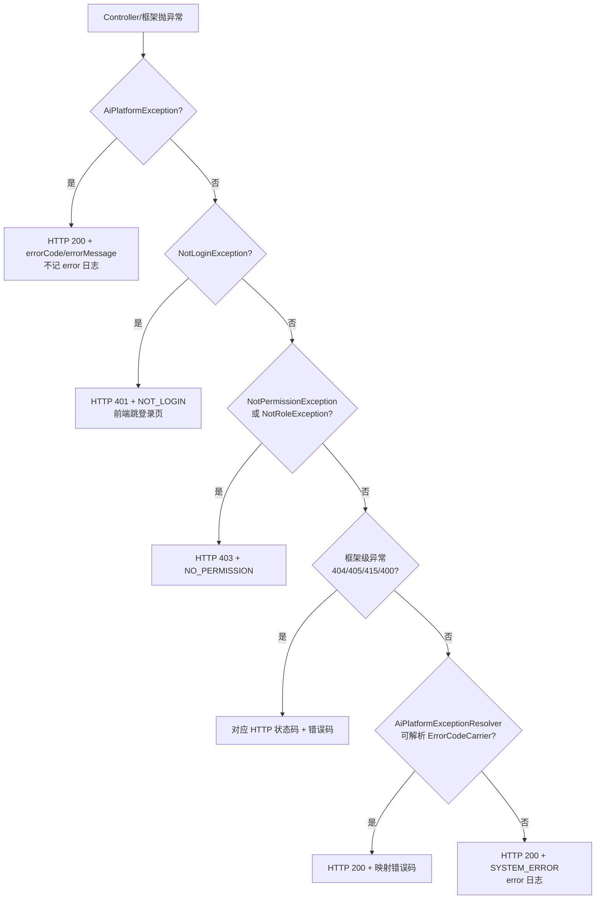

# aiplatform 认证与 RBAC 子系统设计报告（Sa-Token 接入）

> 版本：v1.1　日期：2026-08-13　状态：待评审
> 前置文档：[sa-token-research.md](./sa-token-research.md)、[code-generate-template 使用说明](../../code-generate-template/代码生成器配置文件使用说明.md)
> 红线依据：根目录 `AGENTS.md`（模块依赖方向、命名、模板、事务、日志、校验约定）
>
> v1.1 变更：DDL 对齐生成器 create_time/update_time 强约束；新增「生成器与 generate.yaml 设计」章节；会话存储改为 Redis（归 common-dal，Redis 对象按 DO 规范）；补充日志工具类与 Hutool 使用约束。

## 1. 目标与范围

### 1.1 目标

为本系统补齐「登录注册 + 安全框架 + 基础 RBAC + 菜单管理 + 在线会话管理」，采用 Sa-Token（v1.45.0，`sa-token-spring-boot4-starter`）作为认证与授权引擎，业务数据落库：

- 登录 / 注册 / 登出，token 会话管理；
- RBAC：用户、角色、菜单三实体 + 两张关联表，**无数据隔离（有权限即全量可见）**；
- 菜单管理：菜单树 CRUD + 按角色返回路由树（getRouters）；
- 在线用户查询、踢人下线、强制注销、账号封禁；
- 登录记录（登录成功/失败/踢出/顶出事件日志）；
- 现有 AI 模块（`/ai/chat/**`、`/ai/mirror/**`）接入登录态，业务代码零改动。

### 1.2 非目标（本期不做）

- 数据权限（部门/数据范围 SQL 拼接）——明确不做；
- SSO / OAuth2 / 多租户 / 记住我（Sa-Token 插件支持，本期不引入）；
- 验证码 / 防爆破（登录失败封禁列为增强项，M4 可选）；
- 前端用户/角色/菜单管理页（本期后端接口先行，管理页 M3 可选，先用 SQL 维护）；
- 会话存储采用 Redis（重启不丢、可多实例），开发期未配置 Redis 时退回内存模式。

### 1.3 术语

- **会话**：Sa-Token 的 token 及其关联数据（内存/Redis），不属于业务表；
- **权限码**：`auth_menu.perms`，形如 `ai:chat:query`，支持 `art.*` 通配符与 `*` 上帝权限；
- **角色键**：`auth_role.role_key`，形如 `admin` / `common`，供 `@SaCheckRole` 与 `StpInterface.getRoleList` 使用。

---

## 2. 总体设计

### 2.1 架构分层（沿用现有红线）



### 2.2 核心设计决策

| 决策点 | 结论 | 理由 |
|---|---|---|
| 权限数据加载 | 实现 `StpInterface`，Sa-Token 每次校验时自动回调，**不缓存、实时查库** | 官方默认无缓存；改角色/菜单权限下一次请求即生效，无需踢人/重登；本系统量级查询毫秒级 |
| 鉴权方式 | 全局 `SaInterceptor` 路由拦截兜底登录态 + 接口 `@SaCheckPermission/@SaCheckRole` 精确授权 | 双重保险：AI 模块零改动即要求登录；管理接口按权限码收敛 |
| token 传递 | 请求头 `satoken`（前后端分离），登录响应返回 `tokenName + tokenValue` | 与 Sa-Token 默认一致，前端 axios 拦截器统一携带 |
| 用户上下文 | `UserContextInterceptor`（注册在 SaInterceptor 之后）从 `StpUtil.getLoginIdDefaultNull()` 取 userId 写入 `UserContext` | Servlet Filter 阶段 Sa-Token 上下文未初始化，必须放拦截器层；业务层（含 AI 模块）读取方式不变 |
| 注册事务 | `AuthService.register` 走 `AiPlatformTransactionTemplate`（core-model，由 common-dal 装配） | 用户 + 默认角色两表写入必须原子；禁止 `@Transactional` |
| 登录记录 | `AuthLoginListener implements SaTokenListenerForSimple`，事件内 try-catch 写 `auth_login_log` | Sa-Token 不存历史；监听器不抛异常、不阻断登录主流程 |
| 会话存储 | **Redis**（`sa-token-redis-template`，String 序列化），数据源与 Redis DO 归 common-dal；开发期无 Redis 退内存 | 重启不丢会话、在线列表跨实例一致；Redis 是内部数据源，与 MySQL 同属数据访问层，不进 common-integration |
| 在线用户 | `StpUtil.searchTokenValue` 分页 + Redis 在线快照（`AuthOnlineRedisDO`）回填用户信息，**不建 MySQL 在线表** | 比 RuoYi 的 `sys_user_online` 心跳表方案更简单，且避免逐条反查 MySQL |
| 密码 | Hutool `BCrypt.hashpw/checkpw`，库中只存哈希 | 项目已有 hutool-all；不引 Spring Security |
| admin 特判 | `AuthStpInterfaceImpl` 中角色含 `admin` 时返回 `["*"]` 权限 | 避免给 admin 全量插菜单权限记录，且天然兼容新增菜单 |

### 2.3 新增文件清单（逐层）

> 生成器为每张表产出约 19 个文件（DO/Mapper/XML/Model/QueryParam/Convertor/Repository/Service/Manager/web 全套），合计约 114 个生成文件；按「无用代码干掉」约定，生成后只保留被调用文件与方法，下述为**保留后**的清单。

| 模块 | 新增文件（生成器 + 手写） | 手写量 |
|---|---|---|
| bootstrap | `pom.xml`（+`sa-token-spring-boot4-starter`）、`application.yml`（+`sa-token:` 与 `spring.data.redis:` 段） | ~0.5h |
| core-model | `AuthUser/AuthRole/AuthMenu/AuthLoginLog` Model、`AuthUserQueryParam/AuthRoleQueryParam/AuthMenuQueryParam/AuthLoginLogQueryParam`、`ErrorCodeEnum` 6 个新错误码 | 1h |
| common-dal | 6 组 DO/Mapper/XML（生成，`generateController: false`）+ 3 个手写 join SQL + `RedisConfig`/`RedisKeyConstant`/`AuthOnlineRedisDO` | 3h |
| core-repository | `AuthUserRepository/AuthRoleRepository/AuthMenuRepository/AuthLoginLogRepository/AuthOnlineRepository`（Redis 快照读写）+ Impl + 4 个 Convertor | 2.5h |
| core-service | `AuthService/AuthMenuService/AuthSessionService/AuthAdminService` + Impl、`AuthStpInterfaceImpl`、`AuthLoginListener`（登录/登出/踢出同步 Redis 快照） | 6h |
| biz-service-impl | `AuthManager/AuthAdminManager/AuthOnlineManager` + Impl | 2h |
| web | `AuthController/AuthAdminController/AuthOnlineController/AuthLoginLogController`、`AuthParamChecker`、DTO（param/result 各 ~12 个）、`SaTokenConfigure`、`UserContextInterceptor`（替代原 UserContextFilter）、异常处理器扩展 | 5h |
| ui-standalone（M2 起） | `login/index.vue`、`register/index.vue`、`layout`（侧边菜单）、`store`、`router/guard`、`utils/request.js` 改造、`directive/permission` 接真实权限 | 6h |

### 2.4 会话存储设计（Redis）

**归属决策**：Redis 是内部数据源（数据库），不是"外部服务调用"，因此 Redis 客户端、序列化配置与数据对象一律归 `common-dal`（与 MySQL Mapper 同层）；`common-integration` 只保留 DeepSeek / 玄远等外部服务调用，保持"独立可复制"的纯度，不引入内部数据源。

**依赖（common-dal pom）**：

```xml
<!-- Spring Data Redis：提供 RedisTemplate / RedisConnectionFactory（Boot 4 内置 Spring Data Redis 4） -->
<dependency>
    <groupId>org.springframework.boot</groupId>
    <artifactId>spring-boot-starter-data-redis</artifactId>
</dependency>

<!-- Sa-Token Redis 集成：String 序列化（官方 Boot 4 示例方案），自动装配 SaTokenDaoForRedisTemplate，业务代码零改动 -->
<dependency>
    <groupId>cn.dev33</groupId>
    <artifactId>sa-token-redis-template</artifactId>
    <version>1.45.0</version>
</dependency>

<!-- 连接池（可选） -->
<dependency>
    <groupId>org.apache.commons</groupId>
    <artifactId>commons-pool2</artifactId>
</dependency>
```

> 采用官方 Boot 4 示例同款方案（`sa-token-redis-template`，String 序列化），实测会话/在线快照读写正常；开发期无 Redis 可去掉依赖走内存模式。

**新增文件（common-dal）**：

| 文件 | 职责 |
|---|---|
| （无需自定义） | 依赖 Boot 自动配置：`StringRedisTemplate`/`RedisConnectionFactory` 由 spring-boot-starter-data-redis 提供；Sa-Token 的 `SaTokenDaoForRedisTemplate` 由 sa-token-redis-template 自动装配，均无需手写 RedisConfig |
| `redis/RedisKeyConstant` | key 前缀与 TTL 常量（见下表），杜绝魔法字符串 |
| `dataobject/redis/AuthOnlineRedisDO` | 在线会话快照对象（Redis DO，与 MySQL DO 同规约：Lombok @Data，字段对齐存储结构） |

core-repository 侧补充 `AuthOnlineRepository`（+Impl）：封装 `StringRedisTemplate` + Hutool `JSONUtil` 对 `AuthOnlineRedisDO` 的写入/批量读取/删除，core-service 不直接触碰 Redis。

**Redis key 设计**：

| key 前缀 | 内容 | 序列化 | TTL |
|---|---|---|---|
| `satoken:login:token:*` | token → loginId（Sa-Token 内部，沿用框架默认前缀） | Sa-Token 内部（JSON） | 随 token 有效期 |
| `satoken:session:*` | SaSession（含角色/权限会话数据） | Sa-Token 内部（JSON） | 随 token 有效期 |
| `satoken:ban:*` | 封禁记录 | Sa-Token 内部（JSON） | 随封禁时长 |
| `aiplatform:online:{token}` | `AuthOnlineRedisDO`（业务在线快照，token 全局唯一） | JSON | = token 有效期（`RedisKeyConstant.ONLINE_TTL`） |

> Sa-Token 内部 key 沿用框架默认 `satoken:` 前缀，不自定义；业务侧只维护 `aiplatform:online:*` 快照 key。
>
> **v1.1 实测要点**：
> 1. Sa-Token Redis 版 `searchTokenValue` 返回**完整 key**（`satoken:login:token:xxx`），使用时需按 `RedisKeyConstant.SATOKEN_TOKEN_PREFIX` 剥离前缀；
> 2. Hutool `JSONUtil` 将 `LocalDateTime` 序列化为毫秒时间戳，`AuthOnlineRedisDO.loginTime` 改用 ISO 字符串存储，读取时 `Convert.toLocalDateTime`；
> 3. Servlet Filter 阶段 Sa-Token 请求上下文尚未初始化，用户上下文回填移到 SaInterceptor **之后**的 `UserContextInterceptor`（HandlerInterceptor）。

**在线快照生命周期**（由 `AuthLoginListener` 维护，与 Sa-Token 事件绑定）：

| 事件 | 动作 |
|---|---|
| `doLogin` | 写 `AuthOnlineRedisDO`（userId/nickname/loginIp/userAgent/loginTime） |
| `doLogout` / `doKickout` / `doReplaced` | 删除对应快照 |
| 在线列表查询 | `StpUtil.searchTokenValue` 分页取 token → 按 token 批量取快照回填用户信息，不逐条反查 MySQL |

### 2.5 工程规范约束（日志与 Hutool）

**日志管理**（引用 AGENTS.md 第 6 条，本次补强）：

- 统一通过 `AiPlatformLoggerUtil` 打日志，按 `LogFileEnum` 分文件；traceId 自动写入 MDC；
- 禁止业务代码直接使用 `LoggerFactory`、`System.out.println`、`e.printStackTrace()`；
- 禁止手写 try-catch 打日志；异常日志必须携带关键业务上下文（如 userId/sessionId/traceId）；
- 敏感字段（password、token、密钥）禁止打印，确需定位时脱敏（Hutool `StrUtil.hide`）；
- 上述补强已同步写入 `AGENTS.md`。

**Hutool 使用约定**（引用 AGENTS.md 第 3 条，统一收口）：

- 判空/判 blank：`StrUtil` / `CollUtil` / `ArrayUtil` / `ObjectUtil`，禁止手写 `null`/empty 判断；
- 类型转换：`Convert`（如 `Convert.toLong(loginId)`）；字符串处理：`StrUtil.maxLength/hide/blankToDefault` 等；
- 密码：`BCrypt.hashpw/checkpw`；异常解析：`ExceptionUtil` / `EnumUtil`（`AiPlatformTransactionTemplate` 已在用）；
- 禁止造轮子：不手写 JSON/Base64/加解密，统一用 Hutool 已有能力；
- 条件校验仍走 `AiPlatformInvoker`（AGENTS.md 第 2 条），不因引入 Hutool 而绕过。

---

## 3. 数据库设计

### 3.1 实体关系



### 3.2 DDL（MySQL 8，库：`aiplatform`）

```sql
-- 1. 用户表
create table auth_user (
  user_id     bigint       not null auto_increment comment '用户ID',
  username    varchar(50)  not null comment '登录账号',
  nickname    varchar(50)  not null default '' comment '用户昵称',
  password    varchar(100) not null comment '密码（BCrypt 哈希）',
  email       varchar(100) not null default '' comment '邮箱',
  avatar      varchar(255) not null default '' comment '头像路径',
  status      char(1)      not null default '0' comment '状态（0正常 1停用）',
  del_flag    char(1)      not null default '0' comment '删除标志（0存在 2删除）',
  remark      varchar(500) default null comment '备注',
  create_time datetime     not null default current_timestamp comment '创建时间',
  update_time datetime     not null default current_timestamp on update current_timestamp comment '更新时间',
  primary key (user_id),
  unique key uk_auth_user_username (username)
) engine=innodb auto_increment=100 comment='用户表';

-- 2. 角色表
create table auth_role (
  role_id     bigint       not null auto_increment comment '角色ID',
  role_name   varchar(50)  not null comment '角色名称',
  role_key    varchar(100) not null comment '角色权限字符串',
  role_sort   int          not null default 0 comment '显示顺序',
  status      char(1)      not null default '0' comment '状态（0正常 1停用）',
  del_flag    char(1)      not null default '0' comment '删除标志（0存在 2删除）',
  remark      varchar(500) default null comment '备注',
  create_time datetime     not null default current_timestamp comment '创建时间',
  update_time datetime     not null default current_timestamp on update current_timestamp comment '更新时间',
  primary key (role_id),
  unique key uk_auth_role_key (role_key)
) engine=innodb auto_increment=100 comment='角色表';

-- 3. 菜单表（M目录 / C菜单 / F按钮，perms 即权限码来源）
create table auth_menu (
  menu_id     bigint       not null auto_increment comment '菜单ID',
  menu_name   varchar(50)  not null comment '菜单名称',
  parent_id   bigint       not null default 0 comment '父菜单ID（0 为根）',
  order_num   int          not null default 0 comment '显示顺序',
  path        varchar(200) not null default '' comment '路由地址',
  component   varchar(200) not null default '' comment '组件路径',
  menu_type   char(1)      not null default 'M' comment '类型（M目录 C菜单 F按钮）',
  visible     char(1)      not null default '0' comment '是否显示（0显示 1隐藏）',
  status      char(1)      not null default '0' comment '状态（0正常 1停用）',
  perms       varchar(100) default null comment '权限标识',
  icon        varchar(100) not null default '' comment '菜单图标',
  remark      varchar(500) default null comment '备注',
  create_time datetime     not null default current_timestamp comment '创建时间',
  update_time datetime     not null default current_timestamp on update current_timestamp comment '更新时间',
  primary key (menu_id),
  key idx_auth_menu_parent (parent_id)
) engine=innodb auto_increment=1000 comment='菜单权限表';

-- 4. 用户角色关联表
create table auth_user_role (
  user_id bigint not null comment '用户ID',
  role_id bigint not null comment '角色ID',
  create_time datetime not null default current_timestamp comment '创建时间',
  update_time datetime not null default current_timestamp on update current_timestamp comment '更新时间',
  primary key (user_id, role_id),
  key idx_auth_user_role_role (role_id)
) engine=innodb comment='用户角色关联表';

-- 5. 角色菜单关联表
create table auth_role_menu (
  role_id bigint not null comment '角色ID',
  menu_id bigint not null comment '菜单ID',
  create_time datetime not null default current_timestamp comment '创建时间',
  update_time datetime not null default current_timestamp on update current_timestamp comment '更新时间',
  primary key (role_id, menu_id),
  key idx_auth_role_menu_menu (menu_id)
) engine=innodb comment='角色菜单关联表';

-- 6. 登录记录表（唯一需要新建的业务日志表）
create table auth_login_log (
  log_id     bigint       not null auto_increment comment '日志ID',
  user_id    bigint       default null comment '用户ID（失败时可能为空）',
  username   varchar(50)  not null default '' comment '登录账号',
  login_ip   varchar(128) not null default '' comment '登录IP',
  user_agent varchar(255) not null default '' comment '浏览器UA',
  status     char(1)      not null default '0' comment '结果（0成功 1失败 2被踢 3被顶 4注销）',
  message    varchar(255) not null default '' comment '说明',
  login_time datetime     not null default current_timestamp comment '事件时间',
  create_time datetime    not null default current_timestamp comment '创建时间',
  update_time datetime    not null default current_timestamp on update current_timestamp comment '更新时间',
  primary key (log_id),
  key idx_auth_login_log_username (username),
  key idx_auth_login_log_time (login_time)
) engine=innodb auto_increment=1000 comment='登录记录表';
```

> 全部表含 `create_time/update_time` 且由数据库自动维护（生成器强约束，不满足报错不给生成）：`create_time` 需 `DEFAULT CURRENT_TIMESTAMP`，`update_time` 需 `DEFAULT CURRENT_TIMESTAMP ON UPDATE CURRENT_TIMESTAMP`；INSERT/UPDATE 不写这两列，全部依赖数据库。`auth_user/auth_role/auth_menu` 走逻辑删除 `del_flag`；关联表无逻辑删除，删除关系直接物理删行。

### 3.3 种子数据

```sql
-- 内置管理员：admin / admin123（仅本地；生产必改）
insert into auth_user (user_id, username, nickname, password, email, avatar, status, del_flag, remark, create_time, update_time)
values (1, 'admin', '管理员', '$2y$10$HTZxsxmdoQRWu6O3zeQKnOh5sj6rCO1teMMVLSs7A3.VoENld5LCa',
        'admin@aiplatform.local', '', '0', '0', '内置管理员', now(), now());

insert into auth_role (role_id, role_name, role_key, role_sort, status, del_flag, remark, create_time, update_time)
values (1, '超级管理员', 'admin',  1, '0', '0', '内置超级管理员', now(), now()),
       (2, '普通用户',   'common', 2, '0', '0', '注册默认角色',   now(), now());

insert into auth_user_role (user_id, role_id) values (1, 1);

-- AI 菜单（管理页菜单 M3 再补）
insert into auth_menu (menu_id, menu_name, parent_id, order_num, path, component, menu_type, visible, status, perms, icon, remark, create_time, update_time)
values (1,   'AI 应用',  0, 1, '/ai',    null,               'M', '0', '0', null,          'ai',    'AI 应用目录', now(), now()),
       (100, 'AI 对话',  1, 1, 'chat',   'ai/chat/index',    'C', '0', '0', 'ai:chat:query',  'chat',  'AI 对话菜单', now(), now()),
       (101, '镜像加速器', 1, 2, 'mirror', 'ai/mirror/index', 'C', '0', '0', 'ai:mirror:query', 'mirror', '镜像加速器菜单', now(), now());

insert into auth_role_menu (role_id, menu_id)
select 1, menu_id from auth_menu where status = '0';
insert into auth_role_menu (role_id, menu_id)
select 2, menu_id from auth_menu where menu_id in (100, 101);
```

> 种子密码哈希由 `htpasswd -bnBC 10` 生成（`$2y` 前缀）。若 Hutool `BCrypt.checkpw` 校验异常，用项目内 `BCrypt.hashpw("admin123", BCrypt.gensalt())` 重新生成 `$2a` 哈希替换后再导入。

### 3.4 不建 MySQL 表的会话数据（Redis）

在线 token、会话、踢出标记、封禁记录全部由 Sa-Token 管理（Redis，开发期可内存），**不建 MySQL 表**：

| Sa-Token 概念 | 存储 | 生命周期 |
|---|---|---|
| token → loginId | SaTokenDao（Redis 实现） | token 过期 / 注销 / 踢出 |
| SaSession（用户会话） | SaTokenDao（Redis 实现） | 随 token |
| 踢出标记 | token 附加标记 | 随 token |
| 封禁记录 | SaTokenDao（Redis 实现） | `disable` 时长 |
| 在线快照（AuthOnlineRedisDO） | Redis（业务层） | = token 有效期 |

### 3.5 生成器与 generate.yaml 设计

**生成器规范要点**（来源：code-generate-template `README.md` 与 `代码生成器配置文件使用说明.md`，业务项目只接收生成结果）：

| 规范 | 要求 |
|---|---|
| 表强约束 | `create_time/update_time` 必须存在且由数据库自动维护（`DEFAULT CURRENT_TIMESTAMP` / `ON UPDATE CURRENT_TIMESTAMP`），生成前强校验，不满足报错不给生成；INSERT/UPDATE 不写这两列 |
| 主键 | 必须单列主键（按 PRIMARY KEY 元数据识别，不假设叫 id）；复合主键不支持 |
| 审计/保留列 | `create_time`/`update_time` 为强约束列，不生成 DO 字段，INSERT/UPDATE 不写、由数据库维护；`create_by`/`update_by`/`del_flag` 保留列同样不生成 DO 字段 |
| 逻辑删除 | 全局 + 表级两级配置，表级优先；`enable: true` 时三项必填；列存在才启用，否则物理删除 |
| 生成产物 | 标准表 19 文件（含 web/biz）；`generateController: false` 内部表 10 文件（去 web 7 + biz Manager 2）；每表 1 个 `sql/{表名}.sql`（SHOW CREATE TABLE 真实 DDL） |
| 防覆盖 | 已存在文件默认跳过（幂等）；`force_create: true` 强制覆盖并警告 |
| 查询条件 | id + 全部业务字段 + 创建/更新时间区间 + 分页，生成后按需删减 |
| 类型映射 | 默认映射 + 列级配置（enum / json / jsonArray / jsonObject / 强制类型转换）；DO 保持数据库原始类型，转换收敛在 Convertor |

**本项目 generate.yaml 配置**（`generateController: false` 全开：认证域 web/biz 接口全部手写，因为权限注解、password 脱敏、菜单树组装、在线快照等生成器不产出，避免生成后再大改）：

```yaml
projectPrefix: AiPlatform
toolPrefix: AiPlatform
groupId: com.jakt
projectArtifactPrefix: aiplatform

jdbc:
  url: jdbc:mysql://localhost:3306/aiplatform?useUnicode=true&characterEncoding=utf8&serverTimezone=Asia/Shanghai&useSSL=false&allowPublicKeyRetrieval=true
  username: root
  password: "123456"

outputDir: /Users/jakt/IdeaProjects/aiplatform

tables:
  - db_table_name: auth_user
    model_name: AuthUser
    model_comment: 用户表
    generateController: false
    logicDelete:
      enable: true
      column_name: del_flag
      normal_value: 0
      delete_value: 2

  - db_table_name: auth_role
    model_name: AuthRole
    model_comment: 角色表
    generateController: false
    logicDelete:
      enable: true
      column_name: del_flag
      normal_value: 0
      delete_value: 2

  - db_table_name: auth_menu
    model_name: AuthMenu
    model_comment: 菜单权限表
    generateController: false
    logicDelete:
      enable: true
      column_name: del_flag
      normal_value: 0
      delete_value: 2

  - db_table_name: auth_login_log
    model_name: AuthLoginLog
    model_comment: 登录记录表
    generateController: false
```

**生成策略与后续修剪**：

1. 4 张表 × 10 个数据/服务层文件 = 40 个生成文件（DO / Mapper / Mapper.xml / Model / QueryParam / Convertor / Repository / RepositoryImpl / Service / ServiceImpl）；**`auth_user_role` / `auth_role_menu` 为复合主键，生成器暂不支持**（前置强校验报错），改为手写 DO/Mapper/XML（仅批量绑定/删除/查询三个方法）；
2. 手写补：core-service 业务规则（注册/登录/菜单树/在线）、`AuthStpInterfaceImpl`、`AuthLoginListener`、biz Manager、web 全部接口；
3. 按「无用代码干掉」约定，生成后只保留被调用方法与文件：删除生成器通用 Service 层（认证域业务规则手写），`AuthUserQueryParam` 剔除 password 等敏感字段；查询参数按需删减（时间区间保留、无用字段删除）；
4. 建表脚本由生成器产出 `sql/{表名}.sql`（真实 DDL），与 3.2 设计稿比对一致后入库。

---

## 4. 领域模型与错误码设计

### 4.1 core-model 领域模型

延续现有「贫血模型 + 领域服务」风格（模型只有状态与 get/set，规则全部收进 core-service），新增：

| Model | 关键字段（对齐 DDL） | 说明 |
|---|---|---|
| `AuthUser` | userId, username, nickname, password, email, avatar, status, remark（继承 BaseModel） | **password 只进不出**：Repository→web 任何返回路径都不带 password |
| `AuthRole` | roleId, roleName, roleKey, roleSort, status, remark | roleKey 为权限校验标识 |
| `AuthMenu` | menuId, menuName, parentId, orderNum, path, component, menuType, visible, status, perms, icon, remark | menuType M/C/F；children 字段用于树（不入库） |
| `AuthLoginLog` | logId, userId, username, loginIp, userAgent, status, message, loginTime | 事件记录 |
| `AuthUserQueryParam` | username, status, 分页 | 继承 PageParam（时间区间字段内联） |
| `AuthRoleQueryParam` / `AuthMenuQueryParam` / `AuthLoginLogQueryParam` | 对应筛选字段 + 分页 | 同上 |

查询参数继承链保持 `XxxQueryParam → PageParam → BaseModel`；关联表（auth_user_role/auth_role_menu）由生成器产出 `AuthUserRole`/`AuthRoleMenu` Model 与 Repository（`generateController: false`），**不暴露到业务与 web**，关联读写封装在 `AuthUserRepository` / `AuthRoleRepository` 的关联方法中（如 `replaceRoleMenus`、`bindDefaultRole`）。

### 4.2 新增错误码（ErrorCodeEnum）

```java
/** 未登录或登录已过期（HTTP 401）。 */
NOT_LOGIN(30010, "未登录或登录已过期"),
/** 无权限访问（HTTP 403）。 */
NO_PERMISSION(30011, "无权限访问"),
/** 用户名已存在。 */
USERNAME_EXISTS(30012, "用户名已存在"),
/** 用户名或密码错误（不区分具体哪项错误，防枚举）。 */
LOGIN_FAILED(30013, "用户名或密码错误"),
/** 账号已被停用。 */
USER_DISABLED(30014, "账号已被停用"),
/** 账号已被封禁。 */
ACCOUNT_BANNED(30015, "账号已被封禁");
```

### 4.3 密码与安全字段约定

- `auth_user.password` 存 BCrypt 哈希（60 字符），任何接口响应、日志、Assembler 均剔除；
- 注册/登录日志中禁止打印密码明文；
- 登录失败提示统一 `LOGIN_FAILED`，不区分「用户不存在/密码错误」；
- `UserContext` 只承载 userId/userName，不含 token 与 password。

---

## 5. 接口设计

### 5.1 认证接口（AuthController，`/auth`）

| 接口 | 方法 | 入参 | 出参 | 权限 | 异常 |
|---|---|---|---|---|---|
| `/auth/register` | POST | `AuthRegisterRequest{username, password, nickname, email?}` | `AuthLoginResponse{tokenName, tokenValue, userId}` | 匿名放行 | PARAM_INVALID / USERNAME_EXISTS |
| `/auth/login` | POST | `AuthLoginRequest{username, password}` | `AuthLoginResponse` | 匿名放行 | PARAM_INVALID / LOGIN_FAILED / USER_DISABLED |
| `/auth/logout` | POST | - | `AiPlatformResult<Void>` | 登录 | NotLogin 401 |
| `/auth/info` | GET | - | `AuthInfoResponse{user{userId,username,nickname,avatar}, roles[], perms[]}` | 登录 | NotLogin 401 |
| `/auth/routers` | GET | - | `List<MenuRouteResponse>`（树） | 登录 | NotLogin 401 |

`AuthLoginResponse` 字段：`tokenName`（默认 `satoken`）、`tokenValue`、`userId`。注册策略：**注册成功后自动登录**（直接 `StpUtil.login` 并返回 token），如产品要求注册后跳登录页，则去掉自动登录即可。

### 5.2 用户管理（AuthAdminController，`/auth/user`，M3 管理页）

| 接口 | 方法 | 权限码 | 说明 |
|---|---|---|---|
| `/auth/user/page` | GET | `auth:user:list` | 分页，响应剔除 password |
| `/auth/user/{userId}` | GET | `auth:user:query` | 详情（剔除 password） |
| `/auth/user` | POST | `auth:user:add` | 新增（含默认角色） |
| `/auth/user/{userId}` | PUT | `auth:user:edit` | 修改资料/状态 |
| `/auth/user/{userId}/role` | PUT | `auth:user:role` | 分配角色（事务：先删后插 auth_user_role） |
| `/auth/user/{userId}/password` | PUT | `auth:user:resetPwd` | 重置密码（BCrypt 重哈希） |
| `/auth/user/{userId}` | DELETE | `auth:user:remove` | 逻辑删除 |

### 5.3 角色管理（AuthAdminController，`/auth/role`，M3）

| 接口 | 方法 | 权限码 |
|---|---|---|
| `/auth/role/page`、`/auth/role/{roleId}` | GET | `auth:role:list` / `auth:role:query` |
| `/auth/role`、`/auth/role/{roleId}` | POST / PUT | `auth:role:add` / `auth:role:edit` |
| `/auth/role/{roleId}/menu` | PUT | `auth:role:menu`（事务：先删后插 auth_role_menu） |
| `/auth/role/{roleId}/menu-ids` | GET | `auth:role:query`（回显已分配菜单） |
| `/auth/role/{roleId}` | DELETE | `auth:role:remove` |

### 5.4 菜单管理（AuthAdminController，`/auth/menu`，M3）

| 接口 | 方法 | 权限码 | 说明 |
|---|---|---|---|
| `/auth/menu/tree` | GET | `auth:menu:list` | 全量菜单树 |
| `/auth/menu` | POST | `auth:menu:add` | 新增（校验 parent 存在、type 层级） |
| `/auth/menu/{menuId}` | PUT | `auth:menu:edit` | 修改（perms 变化无需踢人，实时生效） |
| `/auth/menu/{menuId}` | DELETE | `auth:menu:remove` | 有子菜单禁止删除 |

### 5.5 在线会话管理（AuthOnlineController，`/auth/online`）

| 接口 | 方法 | 权限码 | 说明 |
|---|---|---|---|
| `/auth/online/list` | GET | `auth:online:list` | `StpUtil.searchTokenValue` 分页 + Redis 在线快照回填，token 脱敏返回 |
| `/auth/online/kickout` | POST | `auth:online:kickout` | `StpUtil.kickout(userId)` |
| `/auth/online/logout` | POST | `auth:online:logout` | `StpUtil.logout(userId)` 强制注销 |
| `/auth/online/disable` | POST | `auth:online:disable` | `StpUtil.disable(userId, seconds)` + `logout`（立即掉线） |
| `/auth/online/untieDisable` | POST | `auth:online:disable` | `StpUtil.untieDisable(userId)` 解封 |

### 5.6 登录记录（AuthLoginLogController，`/auth/login-log`）

| 接口 | 方法 | 权限码 | 说明 |
|---|---|---|---|
| `/auth/login-log/page` | GET | `auth:loginlog:list` | 按 username/status/时间区间分页 |
| `/auth/login-log/{logId}` | DELETE | `auth:loginlog:remove` | 单条删除 |

### 5.7 现有 AI 模块改造点

- Controller 代码**零改动**：登录态由全局 SaInterceptor 兜底；userId 由 `UserContextInterceptor` 从 Sa-Token 读取后写入 `UserContext`；
- 权限按钮级：AI 页面按 `/auth/info` 返回的 perms 控制（前端 `v-hasPermi`），如「删除会话」按钮绑 `ai:chat:delete`（菜单表补 F 类型记录即可）；
- 前端 request.js 增加 token 注入与 401 跳登录逻辑，AI 页面本身不动。

### 5.8 SaTokenConfigure 与拦截器配置

```java
/**
 * Sa-Token 配置：全局登录态兜底 + 放行匿名端点。权限校验用注解（@SaCheckPermission 等）。
 */
@Configuration
public class SaTokenConfigure implements WebMvcConfigurer {

    private static final String[] ANON_URLS = {
            "/auth/login", "/auth/register", "/error",
            "/v3/api-docs/**", "/swagger-ui/**", "/swagger-ui.html"
    };

    @Override
    public void addInterceptors(InterceptorRegistry registry) {
        registry.addInterceptor(new SaInterceptor(handler -> SaRouter
                        .match("/**")
                        .notMatch(ANON_URLS)
                        .check(r -> StpUtil.checkLogin())))
                .addPathPatterns("/**");
    }
}
```

bootstrap `pom.xml` 增加：

```xml
<dependency>
    <groupId>cn.dev33</groupId>
    <artifactId>sa-token-spring-boot4-starter</artifactId>
    <version>1.45.0</version>
</dependency>
```

`application.yml` 增加：

```yaml
sa-token:
  token-name: satoken
  timeout: 86400            # token 有效期（秒）
  active-timeout: -1        # 无操作过期（-1 不启用）
  is-concurrent: false      # 同账号是否允许并发登录
  is-share: false           # 同账号并发登录时是否共享 token
  token-style: uuid
  is-log: false
```

---

## 6. 关键流程设计

### 6.1 注册流程



### 6.2 登录流程



登录时序：



### 6.3 请求鉴权流程（AI 接口示例）



关键点：**权限数据每次校验实时查询**，`getPermissionList` 返回前不缓存；admin 角色直接返回 `["*"]`，通配匹配由 Sa-Token 完成。

### 6.4 菜单树流程（/auth/routers）



前端收到路由树后映射到侧边菜单，`component` 懒加载对应页面；按钮级权限另走 `/auth/info` 的 perms 数组。

### 6.5 在线用户 / 踢人 / 封禁流程



在线列表：`StpUtil.searchTokenValue("", offset, size, true)` 分页取 token → 按 token 批量取 Redis 在线快照（`AuthOnlineRedisDO`，由 `AuthLoginListener.doLogin` 写入）回填 userId/nickname/loginTime/IP → 组装（token 值截断脱敏返回）。快照缺失时兜底 `getLoginIdByToken` + `AuthUserRepository` 查一次。

### 6.6 登录记录监听器流程

```java
/**
 * 登录事件监听器：写登录记录。事件处理失败不影响登录主流程。
 */
@Component
public class AuthLoginListener extends SaTokenListenerForSimple {

    private final AuthLoginLogRepository authLoginLogRepository;

    private final AuthOnlineRepository authOnlineRepository;

    public AuthLoginListener(AuthLoginLogRepository authLoginLogRepository,
                             AuthOnlineRepository authOnlineRepository) {
        this.authLoginLogRepository = authLoginLogRepository;
        this.authOnlineRepository = authOnlineRepository;
    }

    @Override
    public void doLogin(String loginType, Object loginId, String tokenValue, SaLoginParameter loginParameter) {
        writeLog(loginId, "0", "登录成功");
        writeOnlineSnapshot(loginId, tokenValue);   // 在线快照（Redis）
    }

    @Override
    public void doLogout(String loginType, Object loginId, String tokenValue) {
        writeLog(loginId, "4", "注销登录");
    }

    @Override
    public void doKickout(String loginType, Object loginId, String tokenValue) {
        writeLog(loginId, "2", "被踢下线");
    }

    @Override
    public void doReplaced(String loginType, Object loginId, String tokenValue) {
        writeLog(loginId, "3", "被顶下线");
    }

    private void writeLog(Object loginId, String status, String message) {
        try {
            // SaHolder 为跨环境请求抽象，不依赖 web 模块
            String ip = SaHolder.getRequest().getHeader("X-Forwarded-For");
            AuthLoginLog log = new AuthLoginLog();
            log.setUserId(Convert.toLong(loginId));
            log.setUsername(UserContext.getUserName()); // 登录失败场景由业务直接写
            log.setLoginIp(StrUtil.isBlank(ip) ? "127.0.0.1" : ip);
            log.setUserAgent(StrUtil.maxLength(SaHolder.getRequest().getHeader("User-Agent"), 255));
            log.setStatus(status);
            log.setMessage(message);
            log.setLoginTime(LocalDateTime.now());
            authLoginLogRepository.insert(log);
        } catch (Exception e) {
            AiPlatformLoggerUtil.error(LogFileEnum.COMMON_ERROR, "写入登录日志失败", e);
        }
    }

    /**
     * 写在线快照：供在线列表直接回填用户信息，避免逐条反查 MySQL。
     */
    private void writeOnlineSnapshot(Object loginId, String tokenValue) {
        try {
            AuthOnlineRedisDO snapshot = new AuthOnlineRedisDO();
            snapshot.setTokenValue(tokenValue);
            snapshot.setUserId(Convert.toLong(loginId));
            snapshot.setNickname(UserContext.getUserName());
            snapshot.setLoginIp(StrUtil.blankToDefault(SaHolder.getRequest().getHeader("X-Forwarded-For"), "127.0.0.1"));
            snapshot.setLoginTime(LocalDateTime.now());
            authOnlineRepository.save(snapshot);
        } catch (Exception e) {
            AiPlatformLoggerUtil.error(LogFileEnum.COMMON_ERROR, "写入在线快照失败", e);
        }
    }
}
```

`doLogout` / `doKickout` / `doReplaced` 除写日志外调用 `authOnlineRepository.removeByTokenValue(tokenValue)` 清理快照；事件处理全部 try-catch，异常不影响 Sa-Token 主流程。

### 6.7 异常处理设计



异常处理器扩展（`AiPlatformExceptionHandler` 增加分支）：

```java
@ExceptionHandler(NotLoginException.class)
public ResponseEntity<AiPlatformResult<Void>> handleNotLogin(NotLoginException e) {
    AiPlatformLoggerUtil.warn(LogFileEnum.BIZ_SERVICE, "未登录访问 类型={}", e.getType());
    return fail(HttpStatus.UNAUTHORIZED, ErrorCodeEnum.NOT_LOGIN, "未登录或登录已过期");
}

@ExceptionHandler({NotPermissionException.class, NotRoleException.class})
public ResponseEntity<AiPlatformResult<Void>> handleNoPermission(RuntimeException e) {
    AiPlatformLoggerUtil.warn(LogFileEnum.BIZ_SERVICE, "无权限访问 原因={}", e.getMessage());
    return fail(HttpStatus.FORBIDDEN, ErrorCodeEnum.NO_PERMISSION, "无权限访问");
}
```

异常判断汇总：

| 场景 | 异常 | HTTP | 错误码 |
|---|---|---|---|
| token 缺失/失效/过期/被踢 | `NotLoginException` | 401 | NOT_LOGIN(30010) |
| 权限码不足 / 角色不足 | `NotPermissionException` / `NotRoleException` | 403 | NO_PERMISSION(30011) |
| 业务规则（唯一性/状态/归属） | `AiPlatformException` | 200 | 对应业务码 |
| 参数校验失败 | `ValidationException` / 模板捕获 | 200 | PARAM_INVALID |
| 外部集成失败 | `ErrorCodeCarrier` | 200 | 映射码 |
| 未知异常 | `Exception` | 200 | SYSTEM_ERROR |

---

## 7. 分层测试设计（接口 → Mapper）

### 7.1 测试策略

遵循 AGENTS.md：**项目不生成单元测试；测试集中在独立测试模块 `aiplatform-test`，走真实测试数据库（`aiplatform_test`），一路打到 Mapper**。即每层测试都建立在真实 MySQL 之上，逐层覆盖：

```
Mapper SQL → Repository(Convertor/事务) → core-service(业务规则)
    → biz(编排) → web(Controller/鉴权/异常) → 端到端冒烟
```

模块结构：

```
aiplatform-test/                          # 根 pom 新增叶子模块
└── src/test/java/com/jakt/aiplatform/test/
    ├── base/BaseIntegrationTest.java     # @SpringBootTest + @ActiveProfiles("test")
    ├── dal/AuthUserMapperTest.java       # Mapper 层
    ├── dal/AuthRoleMapperTest.java
    ├── dal/AuthMenuMapperTest.java
    ├── dal/AuthLoginLogMapperTest.java
    ├── dal/RedisAccessTest.java          # Redis 序列化/快照/TTL
    ├── repository/AuthUserRepositoryTest.java
    ├── repository/AuthRoleRepositoryTest.java
    ├── repository/AuthOnlineRepositoryTest.java
    ├── service/AuthServiceTest.java      # 业务规则
    ├── service/AuthMenuServiceTest.java
    ├── service/AuthSessionServiceTest.java
    ├── biz/AuthManagerTest.java
    ├── web/AuthControllerTest.java       # MockMvc 全栈
    ├── web/AiModuleAuthTest.java         # AI 接口登录态回归
    └── e2e/AuthFlowE2ETest.java          # 冒烟
```

测试配置（`src/test/resources/application-test.yml`）：数据源指向 `aiplatform_test`，其余配置同生产；测试库在 CI/本地启动前由 `sql/` 下脚本重建。

### 7.2 测试基建

```java
@SpringBootTest(classes = AiPlatformApplication.class)
@ActiveProfiles("test")
@AutoConfigureMockMvc
public abstract class BaseIntegrationTest {

    @Autowired
    protected MockMvc mockMvc;

    @Autowired
    protected JdbcTemplate jdbcTemplate;

    @Autowired
    protected RedisTemplate<String, Object> redisTemplate;

    /** 清理 Sa-Token 会话与测试 Redis 数据，保证用例可重复执行。 */
    @BeforeEach
    void cleanTokens() {
        StpUtil.logout(); // 清当前线程会话
        // 必要时 StpUtil.logout(testUserId) 清理指定账号
        // 测试库专用：按前缀清理在线快照与 Sa-Token 会话（生产禁用 keys 扫描）
        Set<String> onlineKeys = redisTemplate.keys("aiplatform:online:*");
        Set<String> tokenKeys = redisTemplate.keys("satoken:*");
        if (CollUtil.isNotEmpty(onlineKeys)) {
            redisTemplate.delete(onlineKeys);
        }
        if (CollUtil.isNotEmpty(tokenKeys)) {
            redisTemplate.delete(tokenKeys);
        }
    }
}
```

> 说明：真实库测试不强制 `@Transactional` 回滚（Sa-Token 会话在事务外），用用例内数据清理 + 独立 test 库保证可重复执行。

### 7.3 Mapper 层（common-dal）

覆盖目标：SQL 正确性、逻辑删除、唯一约束、join 结果。

| 用例 | 验证点 | 预期 |
|---|---|---|
| `AuthUserMapper.insert/selectById/updateByCondition/deleteById` | 全字段往返、del_flag 过滤 | 插入后可查、删除后查不到 |
| 重复 username 插入 | uk_auth_user_username | 抛 `DuplicateKeyException` |
| `selectByUsername` | 含 del_flag='0' 过滤 | 只返回存在用户 |
| `selectRoleKeysByUserId` | join 三表 + 角色 status 过滤 | 返回 role_key 集合 |
| `selectPermsByUserId` | join 四表 + perms 非空 + 去重 + 状态过滤 | 返回权限码集合（不含 null/''） |
| `selectMenusByUserId` | menu_type M/C + 按 parent_id, order_num 排序 | 返回正确扁平菜单列表 |
| `AuthLoginLogMapper` 分页 | 按 username/status/时间区间筛选 + offset 分页 | 行数与条件一致 |
| Redis DO 序列化往返 | `AuthOnlineRedisDO` 经 `RedisTemplate` 写入/读取 | 字段一致、TTL 生效（剩余时间 ≈ 配置值） |

### 7.4 Repository 层（core-repository）

| 用例 | 验证点 | 预期 |
|---|---|---|
| Convertor 往返 | DO↔Model 全字段一致（含 null 处理） | toModel(toDO(x)) 字段相等 |
| `AuthUserRepository.findByUsername` | 包装 selectByUsername | 返回 Model 或 null |
| `AuthRoleRepository.replaceRoleMenus`（先删后插） | 事务内两步写 | 全部提交或全部回滚 |
| `AuthUserRepository.insertWithDefaultRole` | 组合 Mapper | 用户与 user_role 同时存在 |
| 删除影响行数为 0 | `deleteById` 不存在记录 | 抛 `DELETE_FAILED` |

### 7.5 core-service 层（业务规则）

| 用例 | 验证点 | 预期 |
|---|---|---|
| 注册-用户名已存在 | 预置同名用户 | 抛 `USERNAME_EXISTS`，且未插入新用户 |
| 注册-事务回滚 | 模拟默认角色插入失败 | 用户表无残留（rollback） |
| 登录-密码错误 | 错误密码 | 抛 `LOGIN_FAILED` |
| 登录-停用账号 | status='1' | 抛 `USER_DISABLED` |
| 登录-成功 | 正确密码 | 返回 token，Sa-Token 可 `getLoginIdByToken` |
| 菜单树组装 | 多层菜单 + 乱序 order_num | 树结构正确、兄弟节点按 order_num 排序 |
| `AuthStpInterfaceImpl.getPermissionList` | 普通用户 / admin | 普通返回 join 结果；admin 返回 `["*"]` |
| 权限实时性 | 修改角色菜单后再次 `checkPermission` | 新权限立即通过（不重登） |
| `AuthSessionService.listOnline` | 登录 2 个用户后分页查询 | 在线快照回填昵称/IP，token 脱敏 |
| `AuthSessionService.kickout` | 踢人后 | 原 token 失效 + Redis 快照被删除 |

### 7.6 biz 层（用例编排）

| 用例 | 验证点 | 预期 |
|---|---|---|
| `AuthManager.login` 编排 | service 调用顺序 | 成功/失败透传 service 异常 |
| `AuthManager.getRouters` | UserContext 注入 userId | 返回当前用户菜单树 |
| `AuthOnlineManager.kickout` | 踢人后原 token | `getLoginIdByToken` 返回 null / 再次访问 401 |

### 7.7 web 层（Controller + 鉴权 + 异常）

| 用例 | 验证点 | 预期 |
|---|---|---|
| `/auth/register` 参数校验 | 缺 password / 短密码 | HTTP 200 + `PARAM_INVALID` |
| `/auth/login` 成功 | 正确凭证 | HTTP 200 + success=true + token |
| `/auth/login` 失败 | 错误密码 | HTTP 200 + `LOGIN_FAILED` |
| `/auth/info` 未带 token | 匿名访问 | HTTP 401 + `NOT_LOGIN` |
| `/ai/chat/session/list` 未带 token | 全局拦截器 | HTTP 401，AI 业务未执行 |
| `/ai/chat/session/list` 带 token | 正常会话 | HTTP 200，返回当前用户会话 |
| `/auth/online/kickout` 无权限角色 | 普通用户访问管理接口 | HTTP 403 + `NO_PERMISSION` |
| `/auth/user/page` admin 访问 | 权限码 `auth:user:list` | HTTP 200，响应不含 password |
| 未知路径 | /xx | HTTP 404 |
| 未知异常 | 桩异常 | HTTP 200 + `SYSTEM_ERROR`（error 日志有记录） |

### 7.8 端到端冒烟（AuthFlowE2ETest）

```
注册 → 自动登录 → 断言 Redis 在线快照存在 → /auth/info 拿角色权限 → 带 token 调 /ai/chat/session/create
→ 调 /ai/chat/message 发起对话 → /auth/logout → 断言快照已删 → 再调 AI 接口断言 401
→ admin 登录 → 踢出该用户 → 该用户请求断言 401 → 断言快照已删 + auth_login_log 有被踢记录
```

---

## 8. 安全设计

1. **密码**：BCrypt（10 轮）；库中只存哈希；所有响应/日志/Assembler 剔除 password；
2. **token**：默认 uuid 风格；`timeout=86400`；`is-concurrent=false`（同账号单端登录，新登录顶旧设备）；
3. **匿名端点白名单**：仅 `/auth/login`、`/auth/register`、错误页与 swagger；其余一律先过 `checkLogin`；
4. **权限兜底**：前端隐藏按钮只作体验，后端 `@SaCheckPermission` 才是真正约束；
5. **登录失败信息**：统一 `LOGIN_FAILED`，不暴露用户是否存在；
6. **日志**：登录/登出事件进 `auth_login_log`（按 LogFileEnum 分文件原则，业务日志仍走 `AiPlatformLoggerUtil`）；禁止打印 token、password；
7. **防爆破（增强项 M4）**：登录失败 N 次 → `StpUtil.disable(username, 1800)` + 业务层校验 `isDisable` 后抛 `ACCOUNT_BANNED`；验证码用 Hutool Captcha（可选）。

---

## 9. 里程碑与工作量

| 里程碑 | 内容 | 预估 |
|---|---|---|
| M1 数据与认证 | 6 表 + 种子 + generate.yaml 生成骨架 + bootstrap 集成（Sa-Token + Redis）+ 注册/登录/登出 + 异常处理 + UserContextInterceptor | 1.5-2 人日 |
| M2 授权与菜单 | StpInterface + 全局拦截器 + /auth/info、/auth/routers + 前端登录/注册/布局/守卫 + AI 页面挂菜单 | 1-1.5 人日 |
| M3 管理能力 | 用户/角色/菜单 CRUD + 在线列表/踢人/封禁 + 登录日志 + 管理页（可选） | 1.5-2 人日 |
| M4 增强（可选） | 防爆破/验证码 | 0.5 人日 |
| 测试 | aiplatform-test 模块（Mapper→web 全链路用例，含 Redis 用例） | 1-1.5 人日 |
| **合计** | | **5-7 人日** |

---

## 10. 风险与待确认项

| 项 | 说明 | 处置 |
|---|---|---|
| Boot 4 兼容 | `sa-token-spring-boot4-starter:1.45.0` 官方支持 Spring Boot 4（2026-03-08 发布） | M1 第一步即冒烟验证 starter 装配 |
| 种子密码 `$2y` 前缀 | htpasswd 生成，Hutool BCrypt 兼容性需验证 | 冒烟登录失败则改用 Hutool 生成 `$2a` 哈希 |
| 会话存储 | Redis（本地开发需 Redis 实例；未配置时退内存模式） | M1 引入 `sa-token-redis-template`（String 序列化，官方 Boot 4 示例同款） |
| Sa-Token Redis 版 searchTokenValue | 返回完整 key 而非裸 token 值 | 已按 `SATOKEN_TOKEN_PREFIX` 剥离前缀（AuthSessionServiceImpl） |
| AGENTS.md 与代码现状 | AGENTS.md 记载「TransactionTemplate 已移除」，但代码已恢复 `AiPlatformTransactionTemplate`（common-dal 装配） | 本设计按代码现状执行，实现时同步修订 AGENTS.md |
| AI 模块 sys_ai_* 前缀 | 历史遗留命名，不在本次范围内 | 独立决策是否改名 |
| 注册默认角色 | 种子仅 admin/common 两角色；后续新增角色需人工调整默认绑定逻辑 | M3 角色管理上线后可参数化 |

---

## 11. 实现偏差记录（v1.2，CR 2026-08 整改后）

> 依据 `auth-cr-fix-report.md` 编码军规执行的实现调整，正文章节以本记录为准。

### 11.1 Controller / Manager / Service 按域拆分

原 `AuthAdminController`/`AuthAdminManager`/`AuthAdminService`（用户+角色+菜单混合）已拆分：

| 域 | Controller | Manager | core-service |
|---|---|---|---|
| 认证 | `AuthController`（/auth/login、register、logout、info） | `AuthManager` | `AuthService` |
| 用户 | `AuthUserController`（/auth/user/**） | `AuthUserManager` | `AuthUserAdminService` |
| 角色 | `AuthRoleController`（/auth/role/**） | `AuthRoleManager` | `AuthRoleAdminService` |
| 菜单 | `AuthMenuController`（/auth/menu/** + **/auth/routers**） | `AuthMenuManager` | `AuthMenuService` + `AuthMenuAdminService` |
| 在线 | `AuthOnlineController`（/auth/online/**） | `AuthOnlineManager` | `AuthSessionService` |
| 日志 | `AuthLoginLogController`（/auth/login-log/**） | `AuthLoginLogManager` | `AuthLoginLogService` |

QueryParam 由 Manager 按原始参数构造（含枚举 code 转换），Controller 不 new 任何 Model/QueryParam；DTO→Model 转换全部收口 `AuthAssembler`（`toUser/toRole/toMenu/toMenuUpdate`）。跨 Manager 能力按约定放 `biz.service.shared` 接口（当前无跨调用需求，不生成死代码）。

### 11.2 状态字段枚举化

新增 `EnableStatusEnum`（0/1）、`MenuTypeEnum`（M/C/F）、`VisibleEnum`（0/1）、`LoginLogStatusEnum`（0-4），Model/QueryParam/web DTO 使用枚举，DO 保持 String，Convertor 转换，Mapper XML 查询条件 `#{status.code}`。表数据不变。

### 11.3 其他调整

- 客户端信息（IP/UA）统一 `common-util` 的 `ClientInfoUtil`；
- `AiPlatformException` 新增 `ofThrow(...)` 静态工厂；`AiPlatformTemplate` 的 `beforeService` 为 default；
- 遗留 `BizTemplate`/`BizTemplateCallBack` 已删除（被 `AiPlatformTransactionTemplate` 取代）；
- 分页查询入参（pageNum/pageSize/筛选字段）由 Controller 直接透传 Manager；
- 生成器模板已同步修复（RepositoryImpl 拆行、枚举列 `#{code}`、logicDelete 列缺失警告、skeleton Template default），指导文档补充 D1-D5。

### 11.4 第 2 轮 CR（Assembler 拆分 / 查询对象化 / 常量工具）

- Assembler 按 Controller 一一拆分（6 个），单对象转换首行判空；
- 查询参数对象化：web `XxxQueryRequest` → Assembler `toQueryParam` → `XxxQueryParam`（继承 PageParam）；Manager 只接收 QueryParam；枚举 code 由 `SaTokenConfigure` formatter 绑定；查询校验放宽（为空跳过、分页默认值）；
- common-util `ConvertUtil.map/mapPage` 统一列表/分页转换；`AiPlatformConstant` 收口魔法值；
- core-model 新增 `dto` 包（组合对象不继承 BaseModel，纯 @Data + Serializable）；
- AGENTS.md 军规 4/13 更新（查询对象化、Assembler 拆分与转换工具）。
