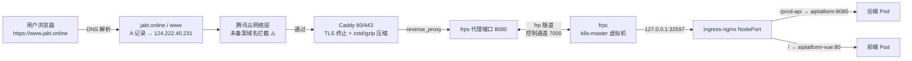

# 公网访问链路：域名 → frps/Caddy → frpc → K8s Ingress 配置文档

> 适用环境：aiplatform 后端 + aiplatform-vue 前端部署在 Mac 上的 multipass 虚拟机（k8s 集群，无公网 IP），
> 通过一台腾讯云公网服务器（frps + Caddy）做内网穿透入口，域名解析到公网服务器后即可从公网访问。
> 本文档包含：整体链路、从一台新公网机器开始的完整配置步骤、当前环境状态快照、页面卡顿性能优化记录、注意事项。

---

## 1. 背景

项目跑在 `k8s-master` 虚拟机的 k8s 集群里，虚拟机本身没有公网 IP。为了让手机/公网能访问，我们买了一个腾讯云公网服务器（124.222.40.231），在上面部署：

- **frps**：frp 服务端，负责接收 frpc 客户端隧道，把公网端口 8080 的流量转发进隧道；
- **Caddy**：Web 服务器，负责 80/443 的 TLS 终止、域名跳转、传输压缩，并把流量反代到 frps 的 8080。

虚拟机里部署 **frpc**：把隧道接到 k8s 的 ingress-nginx NodePort（32597），由 Ingress 按路径把流量分发给后端（`/prod-api` → aiplatform:8080）和前端（`/` → aiplatform-vue:80）。

---

## 2. 名词解释

| 名词 | 说明 |
|---|---|
| frps | frp 服务端，跑在公网服务器上，监听控制端口（7000）和代理端口（8080） |
| frpc | frp 客户端，跑在虚拟机（或任意能访问 k8s NodePort 的机器）上，主动连 frps |
| 控制端口 7000 | frpc 登录 frps 用的通道，不传业务数据，只做控制 |
| 代理端口 8080 | frps 上的 TCP 代理对外端口，公网流量从这里进隧道 |
| Caddy | 公网服务器上的 Web 服务，终结 HTTPS、反代到 127.0.0.1:8080 |
| ingress-nginx | 虚拟机 k8s 集群内的七层负载均衡，按域名+路径路由 |
| NodePort 32597 | ingress-nginx 暴露在节点上的 HTTP 端口，frpc 转发目标 |
| Host 头 | HTTP 请求里的域名头，ingress-nginx 靠它区分路由（aiplatform.jakt.online） |

---

## 3. 整体链路



端口一览：

| 端口 | 监听位置 | 用途 |
|---|---|---|
| 80 / 443 | 公网服务器 Caddy | 域名 HTTP / HTTPS 入口 |
| 7000 | 公网服务器 frps | frp 控制通道（frpc 登录用） |
| 8080 | 公网服务器 frps | `aiplatform-web` TCP 代理对外端口（Caddy 回源目标） |
| 7500 | 公网服务器 frps | frps 管理面板（仅本机/内网访问） |
| 32597 | k8s 节点（VM） | ingress-nginx NodePort HTTP，frpc 转发目标 |

---

## 4. 公网服务器配置步骤（新机器，frps 已下载）

> 前置条件：域名 A 记录已解析到该机器公网 IP（`jakt.online`、`www.jakt.online` 都要解析，见第 6 步）；腾讯云安全组已放行对应端口。

### 4.1 解压安装 frps

以 root 身份操作，frps 解压到 `/root/frp`：

```bash
mkdir -p /root/frp
tar -xzf frp_0.70.0_linux_amd64.tar.gz -C /root/frp --strip-components=1
chmod +x /root/frp/frps
```

### 4.2 编写 frps 配置

`/root/frp/frps.toml`：

```toml
# 控制端口：frpc 客户端通过此端口登录
bindPort = 7000

# 身份验证：客户端必须配置相同 token，防止他人盗用隧道
auth.method = "token"
auth.token = "换成你自己的强密码"

# 管理面板：查看隧道在线状态
webServer.addr = "0.0.0.0"
webServer.port = 7500
webServer.user = "admin"
webServer.password = "改成强密码，不要用 admin"
```

注意：**不需要配 `vhostHTTPPort`**。我们用的是 `type = "tcp"` 的代理，8080 是客户端代理声明的 `remotePort`，frps 收到隧道注册后自动监听。

### 4.3 systemd 托管 frps

`/etc/systemd/system/frps.service`：

```ini
[Unit]
Description=FRP Server
After=network.target syslog.target
Wants=network.target

[Service]
Type=simple
ExecStart=/root/frp/frps -c /root/frp/frps.toml
Restart=on-failure
RestartSec=5s

[Install]
WantedBy=multi-user.target
```

```bash
systemctl daemon-reload
systemctl enable --now frps
systemctl status frps
```

### 4.4 安装并配置 Caddy

下载 Caddy 到 `/usr/local/bin/caddy` 并授权，然后写配置 `/etc/caddy/Caddyfile`：

```caddyfile
# AI 工具台：https://www.jakt.online → frp 隧道(8080) → 虚拟机 ingress-nginx
www.jakt.online {
	encode zstd gzip
	reverse_proxy 127.0.0.1:8080 {
		header_up Host {host}
		header_up X-Real-IP {remote_host}
		header_up X-Forwarded-For {remote_host}
	}
}

# 根域跳转到 www
jakt.online {
	redir https://www.jakt.online{uri} permanent
}
```

systemd 托管（`/etc/systemd/system/caddy.service`）：

```ini
[Unit]
Description=Caddy web server
Documentation=https://caddyserver.com/docs/
After=network.target

[Service]
Type=simple
ExecStart=/usr/local/bin/caddy run --config /etc/caddy/Caddyfile
ExecReload=/usr/local/bin/caddy reload --config /etc/caddy/Caddyfile
Restart=on-failure
RestartSec=5

[Install]
WantedBy=multi-user.target
```

```bash
systemctl daemon-reload
systemctl enable --now caddy
systemctl status caddy
```

### 4.5 安全组 / 防火墙

腾讯云安全组至少放行：

| 端口 | 说明 |
|---|---|
| 80 / 443 | Caddy 对外服务 |
| 7000 | frpc 接入（建议只对客户端出口 IP 或内网放行） |
| 7500 | frps 面板（**不要对公网开放**，仅本机/内网，或用 SSH 隧道访问） |

### 4.6 域名解析

在 DNS 控制台（DNSPod 等）添加两条 A 记录：

```text
jakt.online      A  124.222.40.231
www.jakt.online  A  124.222.40.231
```

验证：

```bash
dig +short jakt.online
dig +short www.jakt.online
```

### 4.7 公网服务器验证

```bash
# 三个端口都在监听
ss -tlnp | grep -E ':(80|443|7000|7500|8080)'

# Caddy 本机回环验证（应返回 308 跳转 https）
curl -s -o /dev/null -w '%{http_code}\n' -H 'Host: www.jakt.online' http://127.0.0.1/

# frps 面板验证（浏览器访问 http://公网IP:7500，或 curl 本机）
curl -s -u admin:你的密码 http://127.0.0.1:7500/api/proxy/tcp
```

---

## 5. 客户端（k8s-master 虚拟机）配置

> 前置条件：k8s 集群里 ingress-nginx 已部署，且 `aiplatform`、`aiplatform-vue` 两个 Ingress 已就绪（见第 6 节）。

### 5.1 安装 frpc

在虚拟机里把 frpc 放到 `/home/ubuntu/frp/` 并授权：

```bash
mkdir -p /home/ubuntu/frp
tar -xzf frp_0.70.0_linux_amd64.tar.gz -C /home/ubuntu/frp --strip-components=1
chmod +x /home/ubuntu/frp/frpc
```

### 5.2 编写 frpc 配置

`/home/ubuntu/frp/frpc.toml`：

```toml
serverAddr = "124.222.40.231"
serverPort = 7000

auth.method = "token"
auth.token = "和 frps.toml 一致"

[[proxies]]
name = "aiplatform-web"
type = "tcp"
localIP = "127.0.0.1"
localPort = 32597
remotePort = 8080
```

要点：

- `remotePort = 8080` 必须和 Caddy 反代目标一致；
- `localIP = "127.0.0.1"` 的前提是 frpc 就跑在 k8s 节点本机（NodePort 会监听 `0.0.0.0:32597`）；如果 frpc 部署在别的机器，这里要改成 VM 的 IP（如 `192.168.252.20`）并保证网络可达。

### 5.3 systemd 托管 frpc

`/etc/systemd/system/frpc.service`：

```ini
[Unit]
Description=FRP Client (aiplatform)
After=network-online.target
Wants=network-online.target

[Service]
Type=simple
ExecStart=/home/ubuntu/frp/frpc -c /home/ubuntu/frp/frpc.toml
Restart=on-failure
RestartSec=5

[Install]
WantedBy=multi-user.target
```

```bash
systemctl daemon-reload
systemctl enable --now frpc
systemctl status frpc
```

### 5.4 客户端验证

```bash
# 1) 本机 NodePort 直连：应返回前端页面（200 或 302）
curl -s -o /dev/null -w '%{http_code}\n' -H 'Host: aiplatform.jakt.online' http://127.0.0.1:32597/

# 2) frps 面板应显示 aiplatform-web 状态 online
curl -s -u admin:你的密码 http://127.0.0.1:7500/api/proxy/tcp
```

---

## 6. Ingress 路由（虚拟机 k8s 内）

Ingress 域名统一用 `aiplatform.jakt.online`，两条规则：

| Ingress | Host | Path | 后端 |
|---|---|---|---|
| `aiplatform` | aiplatform.jakt.online | `/prod-api(/|$)(.*)` | aiplatform:8080（rewrite-target `/$2`） |
| `aiplatform-web` | aiplatform.jakt.online | `/` | aiplatform-vue:80 |

关键注解：

```yaml
metadata:
  annotations:
    nginx.ingress.kubernetes.io/use-forwarded-headers: "true"
```

`use-forwarded-headers: "true"` 配合 Caddy 的 `X-Real-IP` 透传，后端才能拿到真实客户端 IP（否则登录日志全是 127.0.0.1，相关修复见 8.4）。

完整 yaml 在：

- 后端：[deploy/aiplatform.yaml](/Users/jakt/IdeaProjects/aiplatform/deploy/aiplatform.yaml)
- 前端：[aiplatform-vue/deploy/aiplatform-vue.yaml](/Users/jakt/IdeaProjects/aiplatform-vue/deploy/aiplatform-vue.yaml)

---

## 7. 当前环境实际状态快照（2026-08-22）

| 项 | 状态 |
|---|---|
| 公网服务器 frps | 运行中，监听 7000 / 7500 / 8080（/root/frp/frps.toml） |
| 公网服务器 Caddy | 运行中，监听 80 / 443（/etc/caddy/Caddyfile） |
| frps 面板 | `aiplatform-web` 显示 online |
| k8s-master frpc | systemd 服务已停；文件被移走，备份在 `/tmp/frp-moved-backup/`（frpc / frpc.toml / frpc.service） |
| DNS | `jakt.online` 与 `www.jakt.online` 均解析到 124.222.40.231 |

⚠️ 需要你留意的两件事：

1. **当前在线的 frpc 不是 k8s-master 上这个 systemd 服务**（它已停、文件已移走），说明有另一个客户端在别处运行或手动拉起。建议按第 5 节统一收口到 k8s-master 的 systemd 托管，避免隧道断了没人知道。
2. **域名未备案**：腾讯云对未备案域名的大陆访问做网络层拦截（实测：80 端口 302 跳到 `dnspod.qcloud.com/webblock.html`，443 直接 reset，带 `Host: jakt.online` 直连 IP 也会被拦）。电脑偶尔能访问是因为走了 VPN 的海外出口。长期二选一：
   - 去腾讯云完成 ICP 备案（.online 若在境外注册商，需先转入境内注册商）；
   - 或把 frps/Caddy 入口迁到香港/海外服务器（大陆访问无需备案，改动最小：frps 配置 + A 记录）。

---

## 8. “页面卡”性能优化记录

> 主线问题：镜像加速器搜索很慢（如搜 `openjdk:11` 要等很久）。根因是逐个厂商串行探测、部分仓库 tag 接口慢、AI 版本匹配没有超时/缓存。

### 8.1 镜像加速器搜索（后端，主因）

对应实现：[AiMirrorSearchServiceImpl.java](/Users/jakt/IdeaProjects/aiplatform/core/service/src/main/java/com/jakt/aiplatform/core/service/impl/AiMirrorSearchServiceImpl.java)，优化点：

| 优化 | 说明 | 效果 |
|---|---|---|
| 专用线程池 `mirrorSearchThreadPool` | 4 core / 8 max，独立于系统线程池（[ThreadPoolConfig.java](/Users/jakt/IdeaProjects/aiplatform/common/util/src/main/java/com/jakt/aiplatform/common/util/config/ThreadPoolConfig.java)） | 搜索并发不挤占业务线程 |
| 并发探测候选仓库 | 只并发探测 `需要结果数 × 2` 个仓库（`PROBE_FACTOR`），不是把 30 个候选全部串行打一遍 | 搜索耗时从“所有仓库之和”降到“最慢的少数仓库” |
| 单仓库 15s 超时 | `PROBE_TIMEOUT_SECONDS = 15`，失败/超时跳过该仓库 | 个别慢仓库不再拖死整次搜索 |
| tag 匹配三层降级 | 精确版本（含 `11.` / `11-` 前缀）→ AI（IMAGE_VERSION_MATCH，5s 超时）→ 纯代码兜底 | AI 慢/挂时不阻塞，精确命中直接跳过 AI |
| AI 匹配结果缓存 | `ConcurrentHashMap`，key = `repo\|期望版本`，上限 500；无结果也缓存哨兵值 | 重复搜索同一版本不再反复调 AI |
| 本地已下载文件优先 | 已有 N 个结果就少查 N 个厂商 | 已下载过的镜像秒回 |
| tags 去重 + 分阶段耗时日志 | `logPhase` 打印每段耗时 | 定位慢点不用猜 |

对应提交：`f1a07b9 镜像加速器联调问题修复`。

### 8.2 前端静态资源（aiplatform-vue）

[nginx.conf](/Users/jakt/IdeaProjects/aiplatform-vue/nginx.conf)：

- `gzip on` + `gzip_static on`：构建时预压缩的 `.gz` 直接下发，其余动态压缩；
- 静态资源（js/css/图片/字体）`expires 7d` + `Cache-Control: public`，二次访问不走网络；
- `try_files $uri $uri/ /index.html`：Vue history 路由回退，避免刷新 404。

### 8.3 传输层压缩（公网服务器 Caddy）

Caddyfile 里 `encode zstd gzip`：浏览器协商 zstd/gzip，移动网络下页面体量明显变小，弱网体验提升。

### 8.4 链路相关修复（顺带记录）

加了两层代理（Caddy + ingress-nginx）后，后端拿到的客户端 IP 全是 127.0.0.1。修复方案：

- Caddy 透传 `X-Real-IP` / `X-Forwarded-For`；
- ingress 注解 `use-forwarded-headers: "true"`；
- 后端 `ClientInfoUtil` 优先取 `X-Real-IP`。

对应提交：`b355fc0 fix: 登录日志获取真实客户端 IP（X-Real-IP 优先 + ingress 透传转发头）`。

---

## 9. 注意事项

1. **备案是最大坑**：大陆服务器 + 未备案域名，HTTP/HTTPS 全被网络层拦截，改 frp 配置没用（拦截发生在到达服务器之前）。要么备案，要么换香港/海外入口。
2. **Host 头必须一致**：Caddy 透传的是 `www.jakt.online`，而 ingress 规则是 `aiplatform.jakt.online`。如果线上出现 404，先检查这一层——让 Caddy 的 `header_up Host` 与 ingress 的 host 对齐，或给 ingress 补一条 www 规则。
3. **frps 面板和 token**：`7500` 面板不要对公网开放；`admin/admin` 尽快改掉；frp token 别泄露，泄露等于把 8080 端口借给别人用。
4. **frpc 必须自启 + 自动重启**：`Restart=on-failure` + `systemctl enable`，否则隧道断了网站直接打不开。
5. **改配置记得重启**：frps/frpc 改完 `systemctl restart`，Caddy 改完 `systemctl reload caddy`（或 `caddy reload`）。
6. **Caddy 自动 HTTPS 依赖 80 端口 ACME 验证**：备案拦截会导致证书签发失败，此时要么先解决备案，要么先走 HTTP/香港入口。
7. **frpc 不在 VM 本机时**：`localIP` 改成 VM 节点 IP，并确认该机器到 VM 的 32597 端口可达。
8. **安全组最小化**：7000 只对可信出口 IP 放行；7500 用 SSH 隧道访问（`ssh -L 7500:127.0.0.1:7500 root@公网IP`）。

---

## 10. 相关文档

- [Git Push → K8s 自动构建部署（CI 流水线）](ci-cd-auto-deploy.md)：代码提交后自动构建/部署到本集群。
- [认证系统设计](auth-system-design.md)、[Sa-Token 调研](sa-token-research.md)：登录会话与多端策略。
